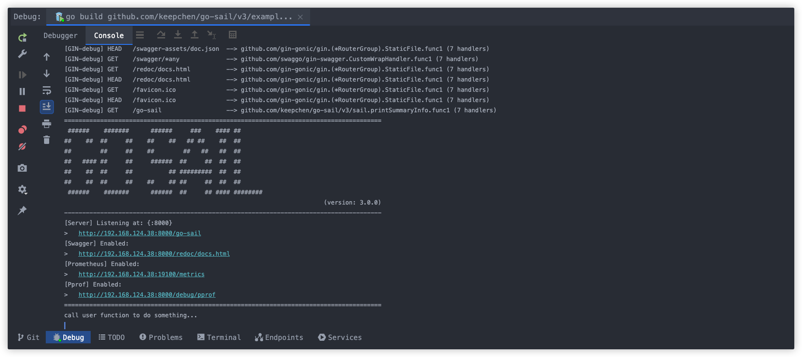
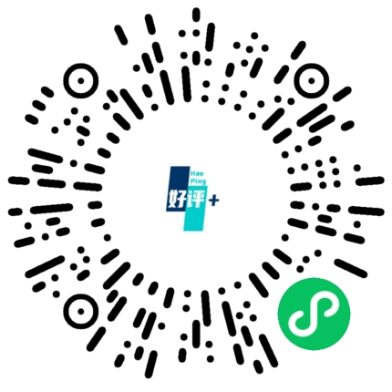

<div align="center">
    <h1></h1>
</div>

[](https://github.com/keepchen/go-sail/actions/workflows/go.yml)
[](https://github.com/keepchen/go-sail/actions/workflows/codeql.yml)
[](https://goreportcard.com/report/github.com/keepchen/go-sail/v3)
[](https://codecov.io/github/keepchen/go-sail)
[](https://github.com/keepchen/go-sail/security/dependabot)
[](https://snyk.io/test/github/keepchen/go-sail)
[](LICENSE)

简体中文 | [English](./README_EN.md)

## go-sail是什么？

**go-sail**是一个轻量的渐进式Web框架，使用Go语言实现。它并**不是重复造轮子的产物**，而是站在巨人的肩膀上，整合现有的优秀组件，旨在帮助使用者以最简单的方式构建稳定可靠的服务。
正如它的名字一般，你可以把它视作自己在golang生态的一个开始。go-sail将助力你从轻出发，扬帆起航。

## 如何使用
> 推荐go version >= 1.20

> go get -u github.com/keepchen/go-sail/v3

```go
import (
    "net/http"
    "github.com/gin-gonic/gin"
    "github.com/keepchen/go-sail/v3/sail"
    "github.com/keepchen/go-sail/v3/sail/config"
)

var (
    conf = &config.Config{}
    registerRoutes = func(ginEngine *gin.Engine) {
        ginEngine.GET("/hello", func(c *gin.Context){
            c.String(http.StatusOK, "%s", "hello, world!")
        })
    }
)

func main() {
    sail.WakeupHttp("go-sail", conf).Hook(registerRoutes, nil, nil).Launch()
}
```
当你看到终端如下图所示内容就表示服务启动成功了：



## 示例
### 配置读取
```go
parseFn := func(content []byte, viaWatch bool){
    fmt.Println("config content: ", string(content))
    if viaWatch {
        //reload config...
    }
}
etcdConf := etcd.Conf{
	Endpoints: "",
	Username: "",
	Password: "",
}
key := "go-sail.config.yaml"

sail.Config(true, parseFn).ViaEtcd(etcdConf, key).Parse(parseFn)
```
### 链路日志追踪
```go
func UserRegisterSvc(c *gin.Context) {
  ...
  sail.LogTrace(c).GetLogger().Warn("log something...")
  ...
}
```
### JWT认证
- 颁发令牌
```go
func UserLoginSvc(c *gin.Context) {
  ...
  uid := "user-1000"
  exp := time.Now().Add(time.Hour * 24).Unix()
  otherFields := map[string]interface{}{
      "nickname": "go-sail",
      "avatar": "https://go-sail.dev/assets/avatar/1.png",
      ...
  }
  ok, token, err := sail.JWT().MakeToken(uid, exp, otherFields)
  ...
}
```
- 认证
```go
func UserInfoSvc(c *gin.Context) {
  ...
  ok, claims, err := sail.JWT().ValidToken(token)
  ...
}
```
### 组件
#### 响应器
```go
func UserInfoSvc(c *gin.Context) {
  sail.Response(c).Wrap(constants.ErrNone, resp).Send()
}
```

#### 数据库
- 读写分离
```go
func UserInfoSvc(c *gin.Context) {
  uid := "user-1000"
  var user models.User
  //READ: query user info
  sail.GetDBR().Where("uid = ?", uid).First(&user)
  ...
  //WRITE: update user info
  sail.GetDBW().Model(&models.User{}).
      Where("uid = ?", uid).
      Updates(map[string]interface{}{
          "avatar": "https://go-sail.dev/assets/avatar/2.png"
      })
}
```
- 事务
```go
func UserInfoSvc(c *gin.Context) {
  uid := "user-1000"
  err := sail.GetDBW().Transaction(func(tx *gorm.DB){
      e1 := tx.Model(&models.User{}).
              Where("uid = ?", uid).
              Updates(map[string]interface{}{
                  "avatar": "https://go-sail.dev/assets/avatar/2.png"
              }).Error
      if e1 != nil {
          return e1
      }
      e2 := tx.Create(&models.UserLoginHistory{
                Uid: uid,
                ...
              }).Error
      return e2
  })
}
```
#### Redis
```go
func UserInfoSvc(c *gin.Context) {
  ...
  sail.GetRedis().Set(ctx, "go-sail:userInfo", "user-1000", time.Hour*24).Result()
  ...
}
```
### 计划任务
- 周期性的
```go
func TodoSomething() {
  fn := func() { ... }
  sail.Schedule("todoSomething", fn).Daily()
}
```
- Linux Crontab风格的
```go
func TodoSomething() {
  fn := func() { ... }
  sail.Schedule("todoSomething", fn).RunAt("*/5 * * * *")
}
```
- 竞态检测
```go
func TodoSomething() {
  fn := func() { ... }
  sail.Schedule("todoSomething", fn).Withoutoverlapping().RunAt("*/5 * * * *")
}
```
### 分布式锁
```go
func UpdateUserBalance() {
  if !sail.RedisLocker().TryLock(key) {
      return false
  }
  defer sail.RedisLocker().Unlock(key)
  ...
}
```

## 文档
[https://go-sail.dev](https://go-sail.dev)  

## 在线示例  
[https://nav.go-sail.dev](https://nav.go-sail.dev)  

## 功能特性
- [x] HTTP响应器
  - 统一响应字段
  - 管理HTTP状态码
  - 管理业务码
- [x] 组件库
  - Database
  - Email
  - Jwt
  - Kafka
  - Logger
  - Nacos
  - Etcd
  - Nats
  - Redis
  - Valkey
- [x] 服务注册与发现
  - Nacos
  - Etcd
- [x] 工具类
  - 加解密
  - 文件
  - ip
  - 字符串
  - 随机数
  - 日期时间
  - ...
- [x] 日志收集与导出
  - 本地文件
  - 导出器
    - Redis
    - Kafka
    - Nats
- [x] 计划任务
  - 可取消的
  - 一次性的
  - 周期性的
  - Linux Crontab风格的
  - 竞态检测
- [x] 遥测与可观测性
  - 调用链追踪
  - Prometheus
  - Pprof
  - 日志导出器
  - 性能检测
    - Prometheus
    - Pprof
- [x] 接口错误码
  - 动态注入
  - 国际化
- [x] 基于Redis的分布式锁
  - 阻塞式
  - 非阻塞式
- [x] 接口文档
  - Redocly
  - Swagger
- [x] 配置管理
  - File
  - Etcd
  - Nacos

#### 其他插件
[README.md](plugins/README.md)

## 基准测试
```shell
ulimit -n 65535 && sh run_benchmark.sh
```  
测试结果（真实的HTTP请求）  
```text
goos: darwin
goarch: amd64
pkg: github.com/keepchen/go-sail/v3
cpu: Intel(R) Core(TM) i7-9750H CPU @ 2.60GHz
BenchmarkGoSailParallel-12    88252    12898 ns/op    8860 B/op    92 allocs/op
BenchmarkGinParallel-12       96548    11722 ns/op    7187 B/op    82 allocs/op
PASS
ok    github.com/keepchen/go-sail/v3  3.663s
```  
  


## 大感谢
感谢在体验、使用过程中提出宝贵建议和意见以及提供过其他各种帮助的各位小伙伴！
- 配置模块化优化建议 [@fujilin](https://github.com/fujilin)
- 响应器语法糖增强优化建议 [@lichuanzhang](https://github.com/lichuanzhang)
- Logo美化 [@ShuaiRen34](https://twitter.com/ShuaiRen34)

## 其他
- 欢迎大家提PR: [pull request](https://github.com/keepchen/go-sail/compare)
- 欢迎大家提出自己的想法: [issue](https://github.com/keepchen/go-sail/issues/new/choose)
- 感谢你的star如果你喜欢这个项目的话 :)

## 使用案例
<table style="text-align: center">
  <tr style="height:200px">
    <td style="border: 1px solid black; padding: 8px;">
      <a href="https://stardots.io?ref=go-sail" target="_blank"></a>
    </td>
    <td style="border: 1px solid black; padding: 8px;">
      <a href="https://t.me/PiggyPiggyofficialbot" target="_blank"></a>
    </td>
    <td style="border: 1px solid black; padding: 8px;">
      
    </td>
  </tr>
  <tr style="height:200px">
    <td style="border: 1px solid black; padding: 8px;">
      
    </td>
    <td style="border: 1px solid black; padding: 8px;">
      
    </td>
    <td style="border: 1px solid black; padding: 8px;">
      <a href="https://fantagoal.io" target="_blank"></a>
    </td>
  </tr>
</table>

## 赞助
[](https://dartnode.com "Powered by DartNode - Free VPS for Open Source")

## Star历史

