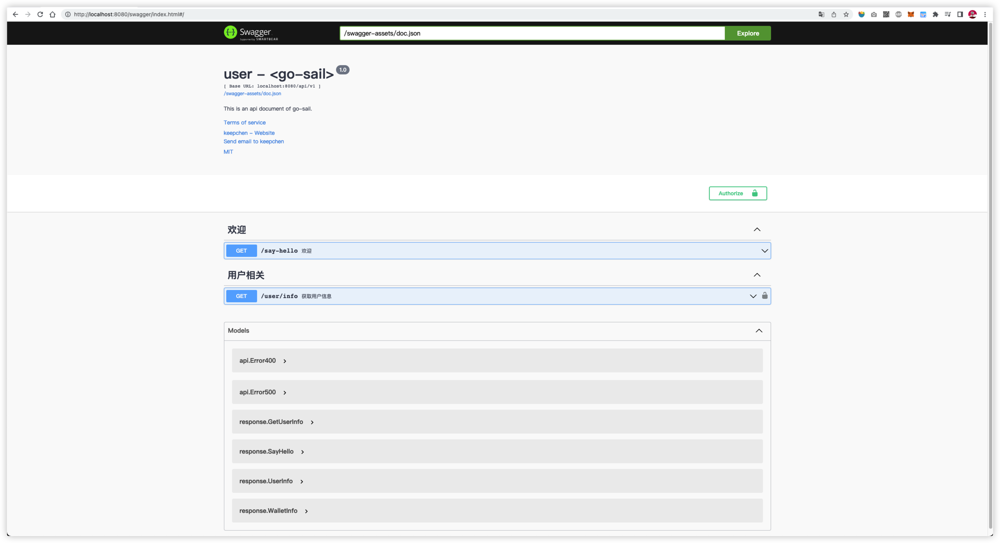
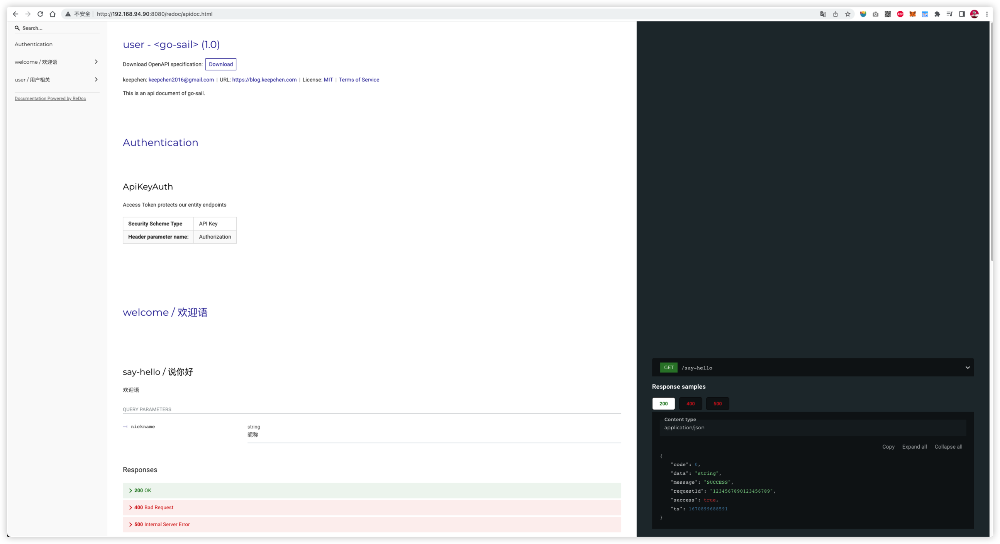

<div align="center">
    <h1></h1>
</div>

English | [简体中文](./README_CN.md)

## What is go-sail?  

The **go-sail** is a lightweight golang project directories.  
It is **not a framework**, but stands on the shoulders of giants, and properly organizes and organically combines the required 
components to ensure production availability.   
It is more of an **idea** to make the project as streamlined and tidy as possible under the premise.  
Use subcommands to realize the split of functional modules/services, and complete service registration and automatic discovery through the configuration center.  
Moving from monolithic architecture to the era of microservices.  
`go-sail user` starts the user service, `go-sail order` starts the order service, ...  

Just like its name, you can regard it as the beginning of your golang ecology. go-sail will help you start lightly and set sail.

## Installation  
[go-sail cli](./cli/cmd/go-sail)

## Features

#### Http api
Based on the `gin-gonic/gin`http framework, it has lightweight and high-performance features, and realizes basic routing registration,parameter binding, and middleware mounting functions.

- Register routes

```go
r := gin.Default()
r.GET("/say-hello", handler.SayHello)
```  

- Parameters binding

```go
var (
    form request.SayHello
    resp response.SayHello
)
if err := c.ShouldBind(&form); err != nil {
    api.New(c).Assemble(constants.ErrRequestParamsInvalid, nil).Send()
    return
}
```  

- Form validator
```go
var (
    form request.SayHello
    resp response.SayHello
)
if errorCode, err := form.Validator(); err != nil {
    api.New(c).Assemble(errorCode, nil, err.Error()).Send()
    return
}
```

- Unified response
```go
import "github.com/keepchen/go-sail/pkg/common/http/api"

//Automatically set the http status code according to the business error code
api.New(c).Assemble(constants.ErrNone, anyResponseData).Send() // <- 200
api.New(c).Assemble(constants.ErrRequestParamsInvalid, nil).Send() // <- 400
api.New(c).Assemble(constants.ErrInternalSeverError, nil).Send() // <- 500

//Specify http status code
api.New(c).Assemble(constants.ErrInternalSeverError, nil).SendWithCode(400) // <- 400

//Custom return message prompt
api.New(c).Assemble(constants.ErrInternalSeverError, nil, "Whoops!Looks like something went wrong.").SendWithCode(400) // <- 400
```

- Printing of log request parameters based on routing middleware, allowing cross-domain, Prometheus index recording

```go
//Globally print request payload, release cross-domain requests, write to Prometheus exporter
r.Use(mdlw.PrintRequestPayload(), mdlw.WithCors(allowHeaders), mdlw.PrometheusExporter())
```  

#### Log component
The go-sail is based on `uber/zap` log library and `natefinch/lumberjack` log rotation class library, realizes the logging function by module and file, and supports configuration files to enable redis list-based
The logstash import scheme.

```go
//::Initialize the log component
logger.InitLoggerZap(config.GetGlobalConfig().Logger, "appName")

//::Initialize the log component (define different modules)
logger.InitLoggerZap(config.GetGlobalConfig().Logger, "appName", "api", "cron", "db")

//Call log component
logger.GetLogger().Info("hello~")

logger.GetLogger("api").Info("中间件:打印请求载荷", zap.Any("value", string(dump)))

logger.GetLogger("db").Error("数据库操作:CreateUserAndWallet:错误",
zap.Any("value", logger.MarshalInterfaceValue(userAndWallet)), zap.Errors("errors", []error{err}))
```  

#### Database components
The go-sail is based on the `gorm.io/gorm` database class library, which realizes the read-write separation function. Thanks to gorm's rich driver support, go-sail supports `mysql`, `sqlserver`, `postgresql`, `sqlite`, `clickhouse` database operations.

```go
import "github.com/keepchen/go-sail/pkg/lib/db"

dbInstance := db.GetInstance()
dbR := dbInstance.R // <- read instance
dbW := dbInstance.W // <- write instance

err := dbR.Where(...).First(...).Error
err := dbW.Where(...).Updates(...).Error
```

#### Cache components
The go-sail is based on the redis class library of `go-redis/redis`, and realizes the access function of redis single instance and cluster.

```go
import "github.com/keepchen/go-sail/pkg/lib/redis"

redisInstance := redis.GetInstance()
redisInstance.Set(context.Background(), key, string(value), expired).Result()

redisClusterInstacne := redis.GetClusterInstance()
redisClusterInstacne.Set(context.Background(), key, string(value), expired).Result()
```

#### Configuration center
The go-sail is based on the configuration center class library of `nacos-group/nacos-sdk-go`, which integrates configuration hot-update, service registration and discovery functions.  

#### Documentation tool
The go-sail is based on the `swaggo/swag` tool, which implements the openapi document generation function. At the same time, go-sail provides two document UI tools for you to choose:  
1.Swagger UI based on `swaggo/gin-swagger` class library

  

2.Redoc UI based on `Redocly/redoc` tool



#### Continuous integration
The go-sail project uses the `harness/drone` CI/CD tool to realize automated testing, integration, and release of engineering projects. Refer to [.drone.yml](./.drone.yml) file configuration. About the deployment and use of the `drone`ci tool, if you are interested,
Please move to [GitLab+Drone experience](https://blog.keepchen.com/a/the-gitlab-drone-experience.html)。

#### Build and deploy
The go-sail provides `Dockerfile` docker image build script, and also provides quick build commands (shell commands) to help you complete image build quickly and conveniently. For a mirror repository,
You can refer to [keepchen/docker-compose](https://github.com/keepchen/docker-compose/tree/main/harbor) related content about harbor construction.
For the quick start of the project service, you can refer to [docker-compose.yml](./docker-compose.yml) in the project directory.

## Project dependencies

#### Component/Class Library

- [spf13/cobra](https://github.com/spf13/cobra)
- [gin-gonic/gin](https://github.com/gin-gonic/gin)
- [swaggo/gin-swagger](https://github.com/swaggo/gin-swagger)
- [gorm.io/gorm](https://github.com/go-gorm/gorm)
- [go.uber.org/zap](https://github.com/uber-go/zap)
- [go-redis/redis](https://github.com/go-redis/redis)
- [jinzhu/configor](https://github.com/jinzhu/configor)
- [stretchr/testify](https://github.com/stretchr/testify)
- [natefinch/lumberjack](https://https://github.com/natefinch/lumberjack)
- [prometheus/client_golang](https://github.com/prometheus/client_golang)
- [nacos-group/nacos-sdk-go](https://github.com/nacos-group/nacos-sdk-go) (optional)
- [golang-jwt/jwt](https://github.com/golang-jwt/jwt) (optional)

#### Command tools

- [swag](https://github.com/swaggo/swag) (version>=1.8.4)
- [redoc-cli](https://github.com/Redocly/redoc) (version=latest)
- [golangci-lint](https://github.com/golangci/golangci-lint) (version>=1.47.0)

## How to use?

#### golang version
version >= 1.18

#### Start service

Before starting the service, you need to build the necessary dependent services, such as mysql database and redis cache. To help you run the service quickly, go-sail provides a basic service startup script based on docker-compose.
For details, refer to the relevant content in the `ecosystem` directory.
The ip address in the configuration file is a random sample, **Please modify the actual value to your own ip address** (Please **don’t** use `127.0.0.1`).  
- mysql
```shell
cd ecosystem/docker-compose/mysql

docker-compose up -d
```  
After the command is executed, the mysql service will be started, listening to the `33060` port, and the account/password is: `root`/`root`.

- redis
> Before executing the command, please globally replace `192.168.224.114` in `ecosystem/docker-compose/redis/docker-compose.yml` with your own ip address.  

```shell
cd ecosystem/docker-compose/redis

docker-compose up -d
```  
After the command is executed, the redis cluster service will be started, the cluster will run in `cluster` mode, the listening port range: `6379`~`6384`, and the authentication password is: `changeme`.  

- nacos(optional)
```shell
cd ecosystem/docker-compose/nacos

docker-compose up -d
```  
After the command is executed, the mysql service and the nacos service will be started. The mysql service here is an independent service designed to only provide storage services for nacos; nacos runs in `standalone` mode, and the account/password is: `nacos`/`nacos` .
Access `localhost:8848/nacos` with a browser, and enter the account password to enter the console.
Create a namespace and configuration file:  
1.Enter `Namespace`, click `New Namespace`, enter `go-sail-user` in the input box of `Namespace Name`, enter `go-sail user service` in the input box of `Description`, click ` OK `Save.  
2.Go to `Configuration Management` > `Configuration List`, select the `go-sail-user` namespace on the right, and click the + sign on the right to add a new configuration. Enter `go-sail-user.yml` in the `Data ID` input box, enter `go-sail` in the `group` input box,
Select `YAML` for `Configuration Format`, then copy and paste the content in `config-user.sample.yml` into the `Configuration Content` text field, and click Publish.
> Remember to globally replace the ip address in the configuration content with your own ip address.

3.Go back to the `namespace` list and record the namespace id of `go-sail-user`.  
4.Set environment variables and start the service:  
```shell
export nacosAddrs=<nacos address> # example：192.168.224.114:8848
export nacosNamespaceID=<go-sail-user namespace id>

go mod tidy

go run main.go user
```  
5.If you don't want to use nacos, you can also start it from a local configuration file.  
> If you do not read the configuration from nacos to start the service, go-sail will not register the service in nacos.

```shell
go mod tidy

go run main.go user -c ./config-user.sample.yml
```  

Web pages：
- Swagger ui(debug=true)  
  [http://localhost:8080/swagger/index.html](http://localhost:8080/swagger/index.html)
- Redoc ui(debug=true)  
  [http://localhost:8080/redoc/apidoc.html](http://localhost:8080/redoc/apidoc.html)
- Prometheus metrics  
  [http://localhost:1910/metrics](http://localhost:1910/metrics)
- pprof(debug=true)  
  [http://localhost:8080/debug/pprof](http://localhost:8080/debug/pprof)

#### Command toolkit
- generate openapi
> If your system is Linux or MacOS, you can use the `make` command directly. For more instructions, please refer to `Makefile`.

```shell
make gen-swag-user
```  

- Build images
```shell
docker build --tag go-sail:v1.0.0 .
```  

- Build locally
```shell
CGO_ENABLED=0 GOOS=linux GOARCH=amd64 go build -o ./go-sail
```  

#### Plugins
[README.md](plugins/README.md)

## Use Cases


