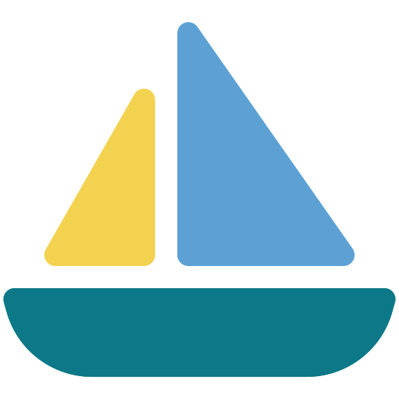
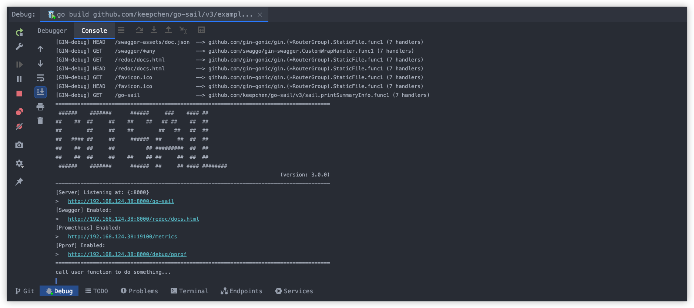
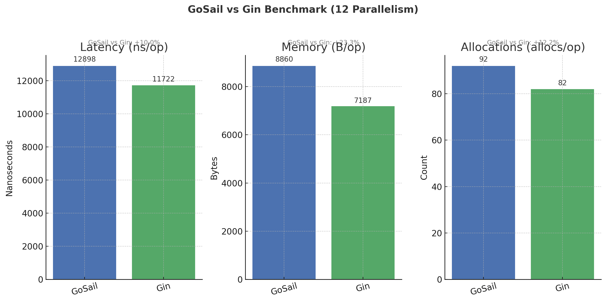
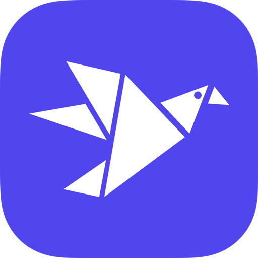
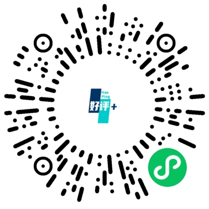

<div align="center">
    <h1></h1>
</div>

[](https://github.com/keepchen/go-sail/actions/workflows/go.yml)
[](https://github.com/keepchen/go-sail/actions/workflows/codeql.yml)
[](https://goreportcard.com/report/github.com/keepchen/go-sail/v3)
[](https://codecov.io/github/keepchen/go-sail)
[](https://github.com/keepchen/go-sail/security/dependabot)
[](https://snyk.io/test/github/keepchen/go-sail)
[](LICENSE)  

[](https://github.com/keepchen/go-sail/tags)  

日本語 | [简体中文](./README.md) | [English](./README_EN.md)

## go-sailとは？

**go-sail**はGo言語で実装された軽量プログレッシブWebフレームワークです。**新たに車輪の再発明をしたのではなく**、巨人の肩の上に立ち、既存の優れたコンポーネントを統合し、最もシンプルな方法でユーザーが安定した信頼性の高いサービスを構築するのを支援します。
その名前が示す通り、Go 言語エコシステムの冒険の始まりとしてお使いください。go-sailは、軽やかに新しい航海へとあなたを導きます。

## 使い方
> goバージョン >= 1.23

> go get -u github.com/keepchen/go-sail/v3

```go
import (
    "net/http"
    "github.com/gin-gonic/gin"
    "github.com/keepchen/go-sail/v3/sail"
    "github.com/keepchen/go-sail/v3/sail/config"
)

var (
    conf = &config.Config{}
    registerRoutes = func(ginEngine *gin.Engine) {
        ginEngine.GET("/hello", func(c *gin.Context){
            c.String(http.StatusOK, "%s", "hello, world!")
        })
    }
)

func main() {
    sail.WakeupHttp("go-sail", conf).Hook(registerRoutes, nil, nil).Launch()
}
```
このように起動した後のコンソール画面例：




## 使用例
### 設定
```go
parseFn := func(content []byte, viaWatch bool){
    fmt.Println("config content: ", string(content))
    if viaWatch {
        //設定ファイルを再読込...
    }
}
etcdConf := etcd.Conf{
	Endpoints: []string{""},
	Username: "",
	Password: "",
}
key := "go-sail.config.yaml"

sail.Config(parseFn).ViaEtcd(etcdConf, key).Parse(parseFn)
```
### ログトレース
```go
func UserRegisterSvc(c *gin.Context) {
  ...
  sail.LogTrace(c).Warn("ログ出力例...")
  ...
}
```
### JWT認証
- トークン発行
```go
func UserLoginSvc(c *gin.Context) {
  ...
  uid := "user-1000"
  exp := time.Now().Add(time.Hour * 24).Unix()
  otherFields := map[string]interface{}{
      "nickname": "go-sail",
      "avatar": "https://go-sail.dev/assets/avatar/1.png",
      ...
  }
  ok, token, err := sail.JWT().MakeToken(uid, exp, otherFields)
  ...
}
```
- 認証
```go
func UserInfoSvc(c *gin.Context) {
  ...
  ok, claims, err := sail.JWT().ValidToken(token)
  ...
}
```
### コンポーネント
#### レスポンダー
```go
func UserInfoSvc(c *gin.Context) {
  sail.Response(c).Wrap(constants.ErrNone, resp).Send()
}
```

#### データベース
- 読み取り / 書き込み
```go
func UserInfoSvc(c *gin.Context) {
  uid := "user-1000"
  var user models.User
  //読み取り: ユーザー情報取得
  sail.GetDBR().Where("uid = ?", uid).First(&user)
  ...
  //書き込み: ユーザー情報更新
  sail.GetDBW().Model(&models.User{}).
      Where("uid = ?", uid).
      Updates(map[string]interface{}{
          "avatar": "https://go-sail.dev/assets/avatar/2.png"
      })
}
```
- トランザクション
```go
func UserInfoSvc(c *gin.Context) {
  uid := "user-1000"
  err := sail.GetDBW().Transaction(func(tx *gorm.DB){
      e1 := tx.Model(&models.User{}).
              Where("uid = ?", uid).
              Updates(map[string]interface{}{
                  "avatar": "https://go-sail.dev/assets/avatar/2.png"
              }).Error
      if e1 != nil {
          return e1
      }
      e2 := tx.Create(&models.UserLoginHistory{
                Uid: uid,
                ...
              }).Error
      return e2
  })
}
```
#### Redis
```go
func UserInfoSvc(c *gin.Context) {
  ...
  sail.GetRedis().Set(ctx, "go-sail:userInfo", "user-1000", time.Hour*24).Result()
  ...
}
```
### タスクスケジューラ
- インターバル実行
```go
func TodoSomething() {
  fn := func() { ... }
  sail.Schedule("todoSomething", fn).Daily()
}
```
- Linux Crontab形式
```go
func TodoSomething() {
  fn := func() { ... }
  sail.Schedule("todoSomething", fn).RunAt("*/5 * * * *")
}
```
- レース検出
```go
func TodoSomething() {
  fn := func() { ... }
  sail.Schedule("todoSomething", fn).Withoutoverlapping().RunAt("*/5 * * * *")
}
```
### 分散ロック
```go
func UpdateUserBalance() {
  if !sail.RedisLocker().TryLock(key) {
      return false
  }
  defer sail.RedisLocker().Unlock(key)
  ...
}
```

## ドキュメント
[https://go-sail.dev](https://go-sail.dev)  

## ライブデモ  
[https://nav.go-sail.dev](https://nav.go-sail.dev)

## 特徴
- [x] HTTPレスポンダー
    - 統一されたレスポンスフィールド
    - HTTPステータスコード管理
    - ビジネスコード管理
- [x] 様々なコンポーネント
    - データベース
    - メール
    - JWT
    - Kafka
    - ロガー
    - Nacos
    - Etcd
    - Nats
    - Redis
    - Valkey
- [x] サービス登録・発見
    - Nacos
    - Etcd
- [x] ツールキット
    - 暗号化・復号化
    - ファイル操作
    - IP
    - 文字列
    - 乱数
    - 日時
    - ...
- [x] ログ収集・エクスポート
    - ローカルファイル
    - エクスポーター
      - Redis
      - Kafka
      - Nats
- [x] スケジュールタスク
    - キャンセル可能
    - 単発実行
    - 定期実行
    - Linux Crontab形式
    - レース検出
- [x] テレメトリ・オブザーバビリティ
  - 呼び出しチェーントレース
  - Prometheus
  - Pprof
  - ログエクスポーター
  - パフォーマンス監視
    - Prometheus
    - Pprof
- [x] APIエラーコード
  - 動的挿入
  - 多言語対応
- [x] Redisベース分散ロック
  - ブロッキング
  - 非ブロッキング
- [x] APIドキュメント生成
  - Redocly
  - Swagger
- [x] 設定
  - ファイル
  - Etcd
  - Nacos

#### その他プラグイン
[README.md](plugins/README.md)

## ベンチマーク
```shell
ulimit -n 65535 && sh run_benchmark.sh
```  
テスト結果 (実際のHTTPリクエスト)  
```text
goos: darwin
goarch: amd64
pkg: github.com/keepchen/go-sail/v3
cpu: Intel(R) Core(TM) i7-9750H CPU @ 2.60GHz
BenchmarkGoSailParallel-12    88252    12898 ns/op    8860 B/op    92 allocs/op
BenchmarkGinParallel-12       96548    11722 ns/op    7187 B/op    82 allocs/op
PASS
ok    github.com/keepchen/go-sail/v3  3.663s
```  


## 感謝
本プロジェクトを体験、使用中に貴重な提案やコメント、さらに色々なご支援をしてくれた皆様に、心より感謝いたします！
- 設定管理のモジュール最適化提案 [@fujilin](https://github.com/fujilin)
- レスポンダー構文補強最適化提案 [@lichuanzhang](https://github.com/lichuanzhang)
- ロゴ美化 [@ShuaiRen34](https://twitter.com/ShuaiRen34)

## その他
- PR歓迎: [pull request](https://github.com/keepchen/go-sail/compare)
- Issue歓迎: [issue](https://github.com/keepchen/go-sail/issues/new/choose)
- 本プロジェクトが気に入ったら、ぜひStarをお願いします :)

## 導入事例
<table style="text-align: center">
    <thead>
        <tr>
            <td style="border: 1px solid black; padding: 8px;">ロゴ</td>
            <td style="border: 1px solid black; padding: 8px;">URL</td>
            <td style="border: 1px solid black; padding: 8px;">カテゴリ</td>
            <td style="border: 1px solid black; padding: 8px;">業界</td>
        </tr>
    </thead>
    <tbody>
        <tr style="height:200px">
            <td style="border: 1px solid black; padding: 8px;">
              
            </td>
            <td style="border: 1px solid black; padding: 8px;">
                <a href="https://fsx120.cn?ref=go-sail" target="_blank">https://fsx120.cn</a>
            </td>
            <td style="border: 1px solid black; padding: 8px;">
                Webサイト
            </td>
            <td style="border: 1px solid black; padding: 8px;">
                医療
            </td>
        </tr>
        <tr style="height:200px">
            <td style="border: 1px solid black; padding: 8px;">
              
            </td>
            <td style="border: 1px solid black; padding: 8px;">
                <a href="https://sendflare.com?ref=go-sail" target="_blank">https://sendflare.com</a>
            </td>
            <td style="border: 1px solid black; padding: 8px;">
                Webサイト
            </td>
            <td style="border: 1px solid black; padding: 8px;">
                SaaS
            </td>
        </tr>
        <tr style="height:200px">
            <td style="border: 1px solid black; padding: 8px;">
              
            </td>
            <td style="border: 1px solid black; padding: 8px;">
                <a href="https://stardots.io?ref=go-sail" target="_blank">https://stardots.io</a>
            </td>
            <td style="border: 1px solid black; padding: 8px;">
                Webサイト
            </td>
            <td style="border: 1px solid black; padding: 8px;">
                SaaS
            </td>
        </tr>
        <tr style="height:200px">
            <td style="border: 1px solid black; padding: 8px;">
              
            </td>
            <td style="border: 1px solid black; padding: 8px;">
              <a href="https://t.me/PiggyPiggyofficialbot" target="_blank">https://t.me/PiggyPiggyofficialbot</a>
            </td>
            <td style="border: 1px solid black; padding: 8px;">
                Telegramミニプログラム
            </td>
            <td style="border: 1px solid black; padding: 8px;">
                Web3 GameFi
            </td>
        </tr>
        <tr style="height:200px">
            <td style="border: 1px solid black; padding: 8px;">
              
            </td>
            <td style="border: 1px solid black; padding: 8px;">
              -
            </td>
            <td style="border: 1px solid black; padding: 8px;">
                WeChatミニプログラム
            </td>
            <td style="border: 1px solid black; padding: 8px;">
                生活サービス
            </td>
        </tr>
        <tr style="height:200px">
            <td style="border: 1px solid black; padding: 8px;">
              
            </td>
            <td style="border: 1px solid black; padding: 8px;">
              <a href="https://fantagoal.io" target="_blank">https://fantagoal.io</a>
            </td>
            <td style="border: 1px solid black; padding: 8px;">
                Webサイト
            </td>
            <td style="border: 1px solid black; padding: 8px;">
                Web3 GameFi
            </td>
        </tr>
        <tr style="height:200px">
            <td style="border: 1px solid black; padding: 8px;">
              
            </td>
            <td style="border: 1px solid black; padding: 8px;">
              -
            </td>
            <td style="border: 1px solid black; padding: 8px;">
                Webサイト
            </td>
            <td style="border: 1px solid black; padding: 8px;">
                Web3 GameFi
            </td>
        </tr>
        <tr style="height:200px">
            <td style="border: 1px solid black; padding: 8px;">
              
            </td>
            <td style="border: 1px solid black; padding: 8px;">
              -
            </td>
            <td style="border: 1px solid black; padding: 8px;">
                Webサイト
            </td>
            <td style="border: 1px solid black; padding: 8px;">
                Web3 GameFi
            </td>
        </tr>
    </tbody>
</table>

## スポンサー
[](https://dartnode.com?ref=go-sail "Powered by DartNode - Free VPS for Open Source")  
[](https://tempmail100.com?ref=go-sail "Secure and Anonymous Temp Mail Service")
[](https://stardots.io?ref=go-sail "Your All-in-One Image Hosting and Transformation Powerhouse")

## Star History  
[](https://www.star-history.com/#keepchen/go-sail&type=date&legend=top-left)  
