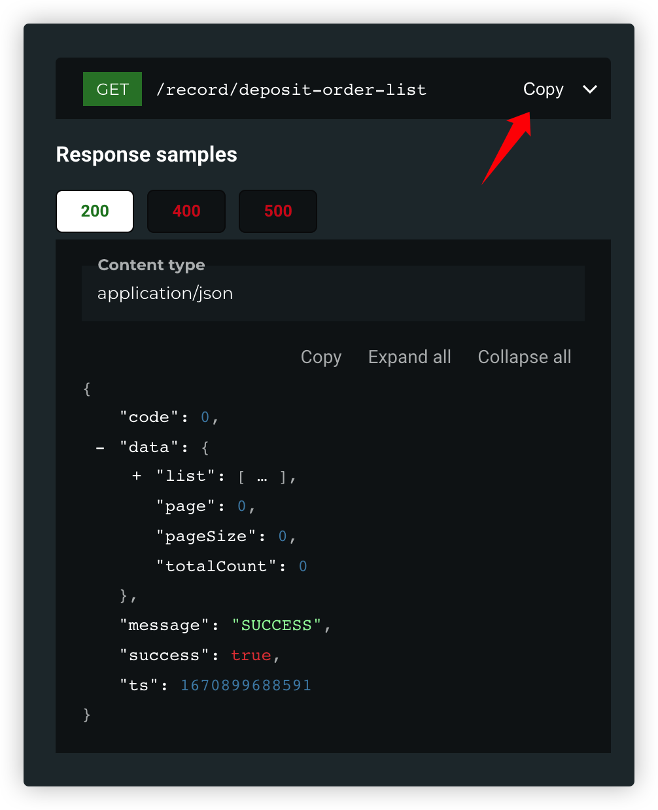

#### redocly copy  
redocly cli生成的文档在复制接口路径的时候非常的不便，
因此我制作了这个插件，功能是在接口路径展示的地方生成
一个复制按钮，方便复制。  
使用方法：  
1.生成最终的文档html文件  
> 记得安装redoc-cli: `npm i -g @redocly/cli@latest`
```shell
redoc-cli build-docs ~/path/to/http/docs/*.yaml -o ~/path/to/http/docs/apidoc.html
```  
2.使用node命令运行注入脚本  
> 这里假设你已经安装好了node环境
```shell
node ~/path/to/redocly-copy.js ~/path/to/http/docs/apidoc.html
```  

> 当你看到 `Inject redocly copy plugin success!` 提示文字的时候，表示插件注入成功。  

3.最终效果  
